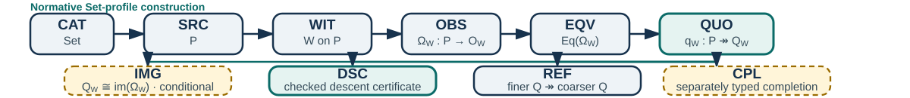

# GQG Core Card · v0.2

## Geometric Quotient Grammar

**Status:** experimental language specification  
**Profile:** `Set` (normative core)  
**Date:** 2026-08-20  
**Attribution:** not specified in the supplied GQG source  
**License:** not specified in the supplied GQG source  
**Continuity:** v0.2 distillation of the supplied GQG working material  
**Purpose:** a typed visual and textual language for witness-relative quotient constructions

> **Claim boundary.** GQG records observations, the equivalence they induce, the quotient they justify, and the proof obligations required for later operations. It does not claim that different application domains are isomorphic, that measurement is quotienting, or that a shared Hamiltonian governs those domains.

## Semantic ownership

**Text source → canonical AST → type checker → formal outputs**  
**Canonical AST → glyph and diagram renderings**

The abstract syntax tree owns the semantics. A rune, commutative diagram, accessible monochrome view, terminal view, and canonical JSON may all render the same accepted tree. Diagram-to-AST parsing is a future feature and must pass semantic round-trip tests before the arrow becomes bidirectional.

## Canonical construction

`CAT → SRC → WIT → OBS → EQV → QUO → (IMG) → {DSC, REF, (CPL)}`

In the normative `Set` profile:

`P ↠ Q_W ≅ im(Ω_W) ↪ ∏_{w∈W} O_w`

Define `O_W := ∏_{w∈W} O_w` and `Ω_W(x) := (w(x))_{w∈W}`. Then `x ~_W y` exactly when `Ω_W(x) = Ω_W(y)`. The image comparison is conditional in other backends: the profile must declare the needed products, kernel pairs, coequalizers, images, and exactness assumptions.

## Token alphabet

| Token | Typed role |
|---|---|
| `CAT` | Ambient category or structural profile |
| `SRC` | Presented source object `P` |
| `WIT` | Witness family `W` on `P` |
| `OBS` | Aggregate observation `Ω_W : P → O_W` |
| `EQV` | Kernel pair / induced equivalence `~_W` |
| `QUO` | Quotient object and map `q_W : P ↠ Q_W` |
| `IMG` | Backend-supported image factorization |
| `DSC` | Certificate that an operation descends |
| `REF` | Witness refinement and quotient comparison |
| `CPL` | Separately typed completion specification |

## Equality lanes

| Lane | Form | Meaning |
|---|---|---|
| Source | `x = y` | The presented elements are equal. |
| Observation | `x ~_W y` | The declared witnesses cannot distinguish them. |
| Quotient | `[x]_W = [y]_W` | They name the same quotient class. |
| Completion | `u = v` in `Q̂_W` | Equality may involve new completion elements; the declared embedding must state what it preserves and reflects. |

Never move a claim between lanes without an explicit constructor or proof.

## Formation rules

1. Declare `CAT` before `SRC`; v0.2 accepts only the explicit declaration `category Set`.
2. Every `WIT` names its source and every `OBS` has a complete domain and codomain.
3. For an arbitrary map, `EQV` means the kernel pair—not an algebraic kernel.
4. Form `QUO` only when the active profile supports the required quotient.
5. Emit `IMG` and `Q_W ≅ im(Ω_W)` only when the backend justifies that factorization.
6. Defining an operation on `Q_W` induced by a source operation requires `DSC`: if each `x_i ~_W y_i`, then `f(x_1,…,x_n) ~_W f(y_1,…,y_n)`. The certificate must reference a checked proof term or an externally verified obligation.
7. A finer witness system induces a finer quotient, and that finer quotient maps canonically onto the coarser quotient; the quotient arrow points fine → coarse.
8. `CPL` must name its added structure (for example, metric, order, topology, or norm). `Set` alone cannot justify a Dedekind completion.



<!-- PAGE BREAK -->

# Worked card

## Minimal source form

```text
category Set
source P = Integers
codomain ParityBits = Z/2Z
witness Parity on P {
  observation omega : P -> ParityBits
  definition omega(n) = n mod 2
}
equivalence same_parity := kernel_pair(omega)
quotient Q2 := P / same_parity
operation add : P × P -> P
certificate add_respects_parity {
  require n ~2 n' and m ~2 m'
  prove n + m ~2 n' + m'
}
descend add through Q2 using add_respects_parity
```

## Parity example

Let `P = Z` and `Ω₂(n) = n mod 2`. Then

`n ~₂ m ⇔ Ω₂(n) = Ω₂(m) ⇔ n − m ∈ 2Z`, so `Q₂ ≅ Z/2Z`.

Addition passes descent:

`n ~₂ n′ and m ~₂ m′ ⇒ n + m ~₂ n′ + m′`.

The operation `h(n) = floor(n/2)` fails. Although `0 ~₂ 2`, its proposed quotient outputs differ:

`[h(0)]₂ = [0]₂ ≠ [1]₂ = [h(2)]₂`.

The checker therefore accepts `DSC[add, add_respects_parity]` after checking its certificate and rejects `DSC[h]`.

## Witness refinement

For `Ω₄(n) = n mod 4` and `Ω₂(n) = n mod 2`, the mod-4 witness is finer:

`~₄ ⊆ ~₂`, hence `Q₄ ↠ Q₂`.

Combining witness families intersects their induced equivalence relations and produces a common refinement in the `Set` profile.

## Diagnostic catalogue

| Code | Rejection |
|---|---|
| `E101` | `QUO` has no declared `EQV`. |
| `E204` | An induced quotient operation has no valid `DSC` certificate. |
| `E301` | `CPL` omits the structure and universal property being added. |
| `E407` | A refinement arrow points coarse → fine. |
| `E512` | The requested quotient–image comparison is unsupported by the active profile. |
| `E610` | A statement crosses equality lanes without a constructor or proof. |

## Illustrative typed machine record

```json
{
  "schema": "gqg-set-0.2",
  "profile": "Set",
  "objects": {
    "P": {"kind": "Set", "presentation": "Integers"},
    "ParityBits": {"kind": "Set", "presentation": "Z/2Z"},
    "Q2": {"kind": "QuotientSet"}
  },
  "witness": "Parity",
  "observation": {
    "name": "omega",
    "domain": "P",
    "codomain": "ParityBits",
    "definition": "n mod 2"
  },
  "equivalence": "kernel_pair(observation)",
  "quotient": {
    "id": "Q2",
    "map": {"name": "q2", "domain": "P", "codomain": "Q2"}
  },
  "descent": {
    "operation": "add",
    "certificate": "add_respects_parity",
    "status": "checked"
  }
}
```

This compact record is illustrative: a production schema must replace free-form expressions with expression AST nodes, define stable identifiers, and specify a JSON canonicalization algorithm. Only then should canonical identity be a digest of canonical JSON for the AST. Prime products may remain an unordered feature signature—useful for indexing which token types occur—but they are not syntax because they lose order, direction, scope, and binding.

## v0.2 acceptance target

- **Parseability:** one valid sentence produces one unambiguous AST.
- **Soundness:** accepted trees satisfy the declared formation rules.
- **Rendering stability:** text and diagrams emitted from one accepted AST preserve the same semantic structure. Any future diagram parser must pass round-trip tests before use.
- **Diagnostic value:** rejected trees receive local, actionable errors.
- **Accessible rendering:** meaning survives without color or decorative glyphs.

**Implementation milestone:** parse the `Set` profile, validate the parity example, emit canonical JSON, and render both a labelled diagram and an accessibility-first text view from the same AST.
